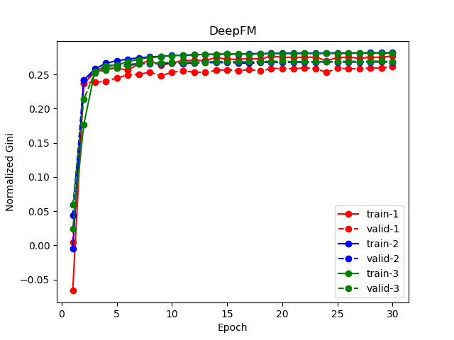
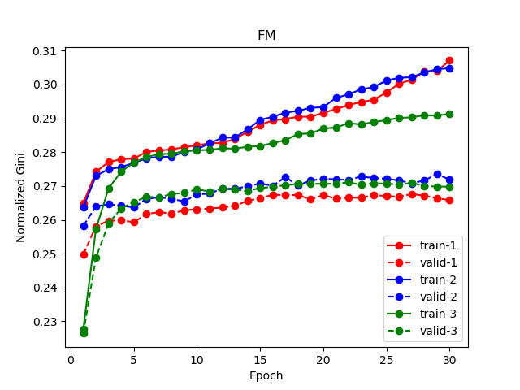
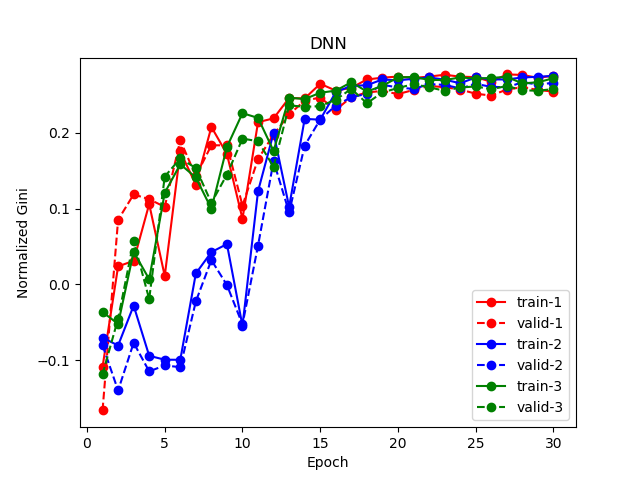

# tensorflow-DeepFM

This project includes a Tensorflow implementation of DeepFM [1].

# NEWS
- A modified version of DeepFM is used to win the 4th Place for [Mercari Price Suggestion Challenge on Kaggle](https://www.kaggle.com/c/mercari-price-suggestion-challenge). See the slide [here](https://github.com/ChenglongChen/tensorflow-XNN/blob/master/doc/Mercari_Price_Suggesion_Competition_ChenglongChen_4th_Place.pdf) how we deal with fields containing sequences, how we incoporate various FM components into deep model.

# Usage
## Input Format
This implementation requires the input data in the following format:
- [ ] **Xi**: *[[ind1_1, ind1_2, ...], [ind2_1, ind2_2, ...], ..., [indi_1, indi_2, ..., indi_j, ...], ...]*
    - *indi_j* is the feature index of feature field *j* of sample *i* in the dataset
- [ ] **Xv**: *[[val1_1, val1_2, ...], [val2_1, val2_2, ...], ..., [vali_1, vali_2, ..., vali_j, ...], ...]*
    - *vali_j* is the feature value of feature field *j* of sample *i* in the dataset
    - *vali_j* can be either binary (1/0, for binary/categorical features) or float (e.g., 10.24, for numerical features)
- [ ] **y**: target of each sample in the dataset (1/0 for classification, numeric number for regression)

Please see `example/DataReader.py` an example how to prepare the data in required format for DeepFM.

## Init and train a model
```
import tensorflow as tf
from sklearn.metrics import roc_auc_score

# params
dfm_params = {
    "use_fm": True,
    "use_deep": True,
    "embedding_size": 8,
    "dropout_fm": [1.0, 1.0],
    "deep_layers": [32, 32],
    "dropout_deep": [0.5, 0.5, 0.5],
    "deep_layers_activation": tf.nn.relu,
    "epoch": 30,
    "batch_size": 1024,
    "learning_rate": 0.001,
    "optimizer_type": "adam",
    "batch_norm": 1,
    "batch_norm_decay": 0.995,
    "l2_reg": 0.01,
    "verbose": True,
    "eval_metric": roc_auc_score,
    "random_seed": 2017
}

# prepare training and validation data in the required format
Xi_train, Xv_train, y_train = prepare(...)
Xi_valid, Xv_valid, y_valid = prepare(...)

# init a DeepFM model
dfm = DeepFM(**dfm_params)

# fit a DeepFM model
dfm.fit(Xi_train, Xv_train, y_train)

# make prediction
dfm.predict(Xi_valid, Xv_valid)

# evaluate a trained model
dfm.evaluate(Xi_valid, Xv_valid, y_valid)
```

You can use early_stopping in the training as follow
```
dfm.fit(Xi_train, Xv_train, y_train, Xi_valid, Xv_valid, y_valid, early_stopping=True)
```

You can refit the model on the whole training and validation set as follow
```
dfm.fit(Xi_train, Xv_train, y_train, Xi_valid, Xv_valid, y_valid, early_stopping=True, refit=True)
```

You can use the FM or DNN part only by setting the parameter `use_fm` or `use_dnn` to `False`.

## Regression
This implementation also supports regression task. To use DeepFM for regression, you can set `loss_type` as `mse`. Accordingly, you should use eval_metric for regression, e.g., mse or mae.

# Example
Folder `example` includes an example usage of DeepFM/FM/DNN models for [Porto Seguro's Safe Driver Prediction competition on Kaggle](https://www.kaggle.com/c/porto-seguro-safe-driver-prediction).

Please download the data from the competition website and put them into the `example/data` folder.

To train DeepFM model for this dataset, run

```
$ cd example
$ python main.py
```
Please see `example/DataReader.py` how to parse the raw dataset into the required format for DeepFM.

## Performance

### DeepFM



### FM



### DNN



## Some tips
- [ ] You should tune the parameters for each model in order to get reasonable performance.
- [ ] You can also try to ensemble these models or ensemble them with other models (e.g., XGBoost or LightGBM).

# Reference
[1] *DeepFM: A Factorization-Machine based Neural Network for CTR Prediction*, Huifeng Guo, Ruiming Tang, Yunming Yey, Zhenguo Li, Xiuqiang He.

# Acknowledgments
This project gets inspirations from the following projects:
- [ ] He Xiangnan's [neural_factorization_machine](https://github.com/hexiangnan/neural_factorization_machine)
- [ ] Jian Zhang's [YellowFin](https://github.com/JianGoForIt/YellowFin) (yellowfin optimizer is taken from here)

# License
MIT